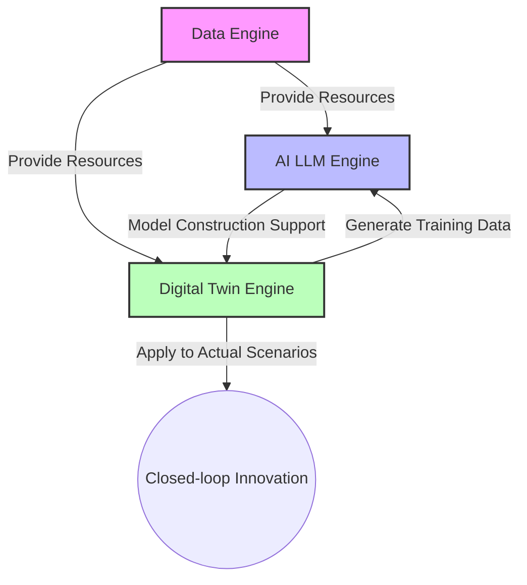

# ZTE Autonomous Networks White Paper

> **Abstract**: Telecom operators are accelerating the construction of highly automated, intelligent networks integrating cloud, network, computing, and AI.

## 1. Core Values of AIR Net

The AIR Net solution provides operators with **three core values**:

1. **Network Monetization**: Enhancing profitability by turning network advantages into market advantages.
2. **Quality and Efficiency Enhancement**: Improving customer satisfaction and reducing MTTR (Mean Time To Repair).
3. **Green and Low-carbon**: Utilizing AI to optimize energy-saving policies.

---

## 2. LLM Application: Copilot Assistants

ZTE leverages LLM capabilities to provide role-oriented assistant products.

| Product Name | User Role | Application Scenario |
| :--- | :--- | :--- |
| **Fault Assistant** | Monitoring Engineer | Fault Handling  |
| **Q&A Assistant** | O&M Engineer | Key Event Assurance  |
| **Monitoring Assistant** | O&M Engineer | O&M efficiency  |

---

## 3. Technology Architecture (Concept)

The digital intelligence engine consists of three key components:
* **Data Engine**: Foundation providing data resources.
* **AI LLM Engine**: The intelligent center for processing resources.
* **Digital Twin Engine**: Realizes virtual-physical interaction.

---

## 4. Acronyms

| Acronyms | English |
| :--- | :--- |
| **5G-A** | 5G-Advanced |
| **GenAI** | Generative AI  |
| **AN** | Autonomous Networks  |
| **ANL** | Autonomous Networks Level  |

---

